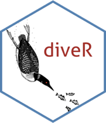

## diveR  

 

'diveR' is a set of `loon` related packages (`diver` is another name for `loon`).

The packages work together to provide a more complete **d**irect manipulation **i**nteractive **v**isualization **e**nvironment in **R**.  
 
It is designed for exploratory data analysis, particularly for data having many dimensions but also provides the tools for the user to develop experimental interactive displays of their own.
    
The package exists primarily to gather the related packages together and to make it easy to install and load these multiple 'diveR' packages in a single step. 

The package manual appears [here] (http://great-northern-diver.github.io/diveR/).

    - an introduction to  `loon` is available [here](http://great-northern-diver.github.io/loon/articles/introduction.html).

