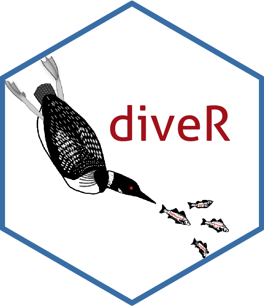

# Direct Interactive Visual Exploration in R.

## diveR  

 

`diveR` is the `looniverse` of `loon` related packages, the **great northern diver** being another name (chiefly British) for the **Common loon** (chiefly North American).

The packages work together to provide a more complete **d**irect manipulation **i**nteractive **v**isualization **e**nvironment in **R**.

It is designed for **exploratory data analysis**, particularly for data having many dimensions, as well as the development of experimental interactive displays.
    
The package `diveR` gathers together and installs the related packages. 
    
The packages include:

- [loon](http://great-northern-diver.github.io/loon/).

  This is the backbone package that provides the interactive graphics.
   
- [loon.data](http://great-northern-diver.github.io/loon.data/).

  Provides a rich collection of data sets to illustrate interactive graphics.  It also includes several artificial data sets constructed for teaching purposes.
  
- [zenplots](http://great-northern-diver.github.io/zenplots/). 

  Extends 
  
  - the base `graphics` package
  - the `grid` graphics package
  - the `loon` interactive graphics package
  
  to allow for the layout of alternating 1d and 2d plots.
  
  Provides compact displays for high dimensional data 
  (e.g., where pairs plots would be too small to be informative).

- [ggmulti](http://great-northern-diver.github.io/ggmulti/). 

  Extends the grammar of the  `ggplot2` package to accommodate displays such as parallel coordinate and Andrews function plots for high dimensional data.
  
- [loon.ggplot](http://great-northern-diver.github.io/loon.ggplot/).

  Provides a bridge between the elegant but static displays of `ggplot2` and the interactive direct manipulation graphics of `loon`
  
  Extends `ggplot2` to provide an **grammar of interactive graphics**
  

